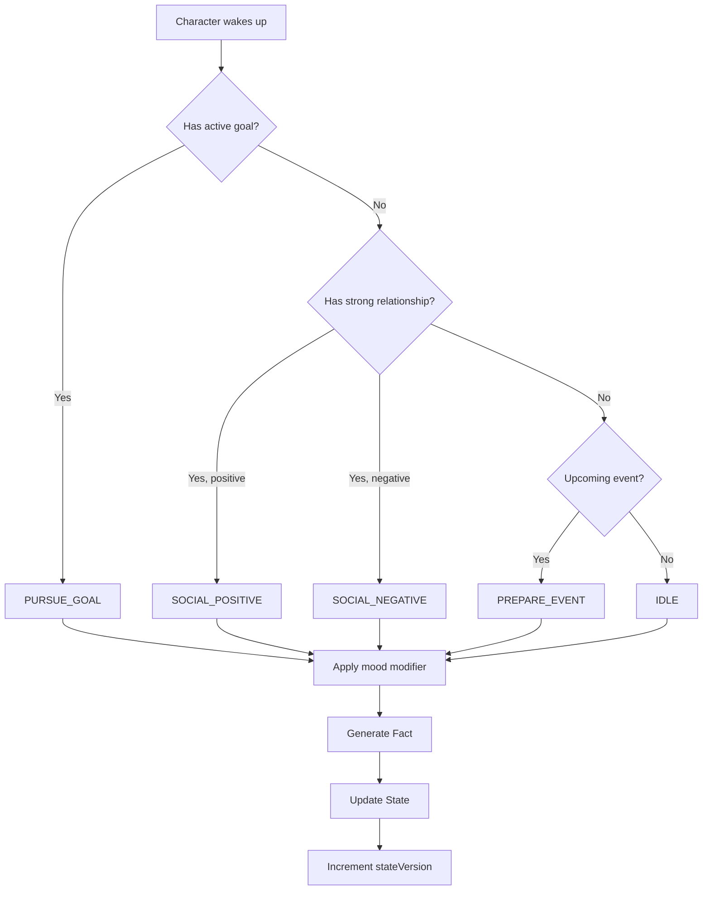

### 4.10 Living World Engine (NPC Autonomy)

#### Философия Дизайна

Living World Engine решает проблему "застывшего мира": **персонажи должны жить своей жизнью, а не замирать в ожидании игрока**. В реальности люди продолжают действовать, когда вы не смотрите: укрепляют дружбу, вынашивают планы, ссорятся. Этот движок создаёт иллюзию непрерывной жизни, моделируя автономные действия NPC "за кадром". Он отвечает на вопрос: **что делали все остальные, пока я спал/отсутствовал?**

#### Overview

The **Living World Engine** enables NPCs to take autonomous, proactive actions during "off-screen" periods (e.g., overnight, between days). This system transforms the game world from purely reactive to dynamic and living, where characters pursue their own goals, nurture or damage relationships, and prepare for events even when the player is not present.

The engine does NOT generate narrative text. Instead, it silently modifies state (relationships, goal progress, character flags) through atomic "facts," and players discover the consequences of these actions at the start of the next scene.

#### Architecture

The Living World Engine consists of three key components:

1. **The Conductor** - Determines when to trigger off-screen simulation
2. **The Actors** - Implements NPC decision-making logic
3. **The Script** - Generates concrete state changes from decisions

#### The Conductor (Simulation Trigger)

**Purpose:** Detect significant time jumps and trigger the simulation cycle.

**Implementation:**

`TimeEngine.advance()` now returns information about time jumps:
```javascript
{
  type: 'ADVANCE_TO_NEXT_MORNING',  // or 'ADVANCE_DAY', 'NONE'
  duration: 'night'                 // or 'day', 'days'
}
```

In `Output.txt`, after `LC.TimeEngine.advance()`:
```javascript
const timeJump = LC.TimeEngine.advance();
if (timeJump.type === 'ADVANCE_TO_NEXT_MORNING' || timeJump.type === 'ADVANCE_DAY') {
  LC.LivingWorld.runOffScreenCycle(timeJump);
  LC.lcSys({ text: `Симуляция мира за кадром завершена (${timeJump.duration}).`, level: 'director' });
}
```

**Triggering Conditions:**
- `ADVANCE_TO_NEXT_MORNING` - Player went to sleep, new day begins
- `ADVANCE_DAY` - Multiple days skip (e.g., weekend, vacation)
- Other time changes (SET_TIME_OF_DAY, ADVANCE_TIME_OF_DAY) do NOT trigger simulation

#### The Actors (Decision-Making Logic)

**Purpose:** Each active NPC makes decisions based on their current state and motivations.

**Main Function:** `LC.LivingWorld.runOffScreenCycle(timeJump)`
- Gets all ACTIVE characters (skips FROZEN)
- Calls `simulateCharacter()` for each one
- Catches and logs errors per character

**Decision Function:** `LC.LivingWorld.simulateCharacter(character)`

Uses a **Motivation Pyramid** to prioritize actions:

**Decision Flow Diagram:**



**Priority 1: Active Goals**
- Checks `L.goals` for active goals belonging to this character
- If found, action = `PURSUE_GOAL`
- Example: Character studying for exam increases `goal_progress` flag

**Priority 2: Strong Relationships**
- If no active goal, checks `L.evergreen.relations[charName]`
- Finds strongest relationship (positive or negative) with |value| ≥ 30
- Positive (>0): action = `SOCIAL_POSITIVE`
- Negative (<0): action = `SOCIAL_NEGATIVE`
- Example: Characters with strong friendship spend time together, improving relationship

**Priority 3: Upcoming Calendar Events**
- If no goal or strong relation, checks `L.time.scheduledEvents`
- If event is within 3 days, action = `PREPARE_EVENT`
- Example: Character prepares for upcoming party

**Mood Modifier:**
- Checks `L.character_status[charName].mood`
- Mood affects action intensity:
  - `ANGRY`, `FRUSTRATED` → more intense negative interactions
  - `HAPPY`, `EXCITED` → more intense positive interactions

#### The Script (Fact Generation)

**Purpose:** Convert decisions into concrete state changes without generating text.

**Main Function:** `LC.LivingWorld.generateFact(characterName, action)`

Returns `undefined` (no text output), only modifies state.

**Action Handlers:**

**PURSUE_GOAL:**
```javascript
// Adds progress to character's goal
character.flags['goal_progress_' + goalKey] += 0.25;
// Capped at 1.0 (100% progress)
```

**SOCIAL_NEGATIVE:**
```javascript
// Decreases relationship values
L.evergreen.relations[char1][char2] -= modifier;  // Base: -5, Angry: -10
L.evergreen.relations[char2][char1] -= modifier;
// Bidirectional, clamped to [-100, 100]
```

**SOCIAL_POSITIVE:**
```javascript
// Increases relationship values
L.evergreen.relations[char1][char2] += modifier;  // Base: +5, Happy: +8
L.evergreen.relations[char2][char1] += modifier;
```

**GOSSIP:**
```javascript
// Spreads existing rumor to new character
rumor.knownBy.push(targetChar);
rumor.distortion += 0.1;
```

**PREPARE_EVENT:**
```javascript
// Sets preparation flag for event
character.flags['event_preparation_' + eventId] = true;
```

All modifications increment `L.stateVersion` to invalidate context cache.

#### State Structure

**Extended Character Flags:**
```javascript
L.characters['CharName'].flags = {
  goal_progress_goal_001: 0.75,        // 75% progress on goal
  event_preparation_party_001: true,   // Prepared for party
  // ... other flags
};
```

**Tracked in Existing Systems:**
- **Relations:** `L.evergreen.relations` (managed by RelationsEngine)
- **Goals:** `L.goals` (managed by GoalsEngine)
- **Events:** `L.time.scheduledEvents` (managed by TimeEngine)
- **Mood:** `L.character_status` (managed by MoodEngine)
- **Rumors:** `L.rumors` (managed by GossipEngine)

#### Integration with Other Systems

**RelationsEngine:**
- Living World modifies relationships through same structure
- Uses numeric values [-100, 100]
- Ensures nested object structure exists before modification

**GoalsEngine:**
- Reads active goals from `L.goals`
- Updates progress via character flags
- Does not complete goals (requires player interaction)

**TimeEngine:**
- Reads `L.time.currentDay` and `scheduledEvents`
- Uses time jump information to trigger simulation
- No circular dependency (TimeEngine → LivingWorld, not reverse)

**MoodEngine:**
- Reads mood from `L.character_status[charName].mood`
- Mood values: HAPPY, SAD, ANGRY, EXCITED, FRUSTRATED, etc.
- Affects magnitude of relationship changes

**GossipEngine:**
- Can spread existing rumors through `Propagator`
- Only spreads rumors character already knows
- Increments distortion on each spread

**CharacterLifecycle:**
- Only processes ACTIVE characters
- Skips FROZEN characters entirely
- Respects character type hierarchy (MAIN, SECONDARY, EXTRA)

#### Practical Examples

**Example 1: Overnight Time Jump with Active Goal**

```
Setup:
- Player goes to sleep (ADVANCE_TO_NEXT_MORNING)
- Максим has active goal: "Подготовиться к экзамену"
- No strong relationships

Simulation:
1. Conductor detects time jump
2. Actor simulates Максим
3. Motivation Pyramid: Active goal found (Priority 1)
4. Script generates fact: goal_progress += 0.25

Result (silent):
L.characters['Максим'].flags.goal_progress_goal_exam = 0.25

Next scene:
Context overlay may show: "GOALS Максим (25% progress): Подготовиться к экзамену"
```

**Example 2: Multi-Day Skip with Strong Relationship**

```
Setup:
- Weekend passes (ADVANCE_DAY, days: 2)
- Хлоя has no active goals
- Strong positive relation with Максим (75)
- Mood: HAPPY

Simulation:
1. Conductor detects 2-day jump
2. Actor simulates Хлоя
3. Motivation Pyramid: No goals, strong positive relation (Priority 2)
4. Mood modifier: HAPPY → +8 instead of +5
5. Script updates relations

Result:
L.evergreen.relations['Хлоя']['Максим'] = 83
L.evergreen.relations['Максим']['Хлоя'] = 83

Next scene:
If player asks about Максим and Хлоя, AI may naturally describe them
as closer friends based on updated relationship value.
```

**Example 3: Complex Multi-Character Scenario**

```
Setup:
- Night passes (ADVANCE_TO_NEXT_MORNING)
- Active characters: Максим, Хлоя, Эшли, Виктор
- Виктор is FROZEN
- States:
  * Максим: Active goal + ANGRY mood
  * Хлоя: Strong positive relation with Максим (70)
  * Эшли: Strong negative relation with Максим (-60)

Simulation:
1. Максим: Pursues goal, progress += 0.25
2. Хлоя: Positive interaction with Максим, relation +5
3. Эшли: Negative interaction with Максим, relation -5
4. Виктор: Skipped (FROZEN)

Results:
- Максим closer to goal completion
- Максим-Хлоя relationship strengthened (75)
- Максим-Эшли conflict deepened (-65)
- Виктор unchanged
- All changes reflected in next scene's context
```

#### Design Philosophy

**Proactive World:**
- NPCs are not waiting for player
- They have agency and pursue their own objectives
- World continues to evolve "off-screen"

**Fact-Based, Not Narrative:**
- No text generation during simulation
- Only atomic state changes
- Player discovers consequences naturally in gameplay

**Integration-First:**
- Uses existing engine APIs (RelationsEngine, GoalsEngine, etc.)
- No duplicate logic or state structures
- Respects all existing constraints (character status, frozen/active, etc.)

**Performance-Conscious:**
- Only runs on significant time jumps
- Skips frozen/inactive characters
- Minimal computational overhead
- Error-isolated (one character error doesn't break others)

#### Testing

Test file: `test_living_world.js`

**Coverage:**
- ✅ Living World Engine structure (runOffScreenCycle, simulateCharacter, generateFact)
- ✅ TimeEngine.advance() returns time jump information
- ✅ Time jump clearing after read
- ✅ FROZEN character filtering
- ✅ Motivation Pyramid - Goal priority
- ✅ Motivation Pyramid - Positive relationship priority
- ✅ Motivation Pyramid - Negative relationship priority
- ✅ Motivation Pyramid - Event preparation priority
- ✅ Mood modifier effects (ANGRY, HAPPY, etc.)
- ✅ Silent fact generation (no text output)
- ✅ Goal progress tracking
- ✅ Relationship modifications (positive and negative)
- ✅ Event preparation flags
- ✅ Multi-character complex scenarios
- ✅ Integration with Output.txt

---
