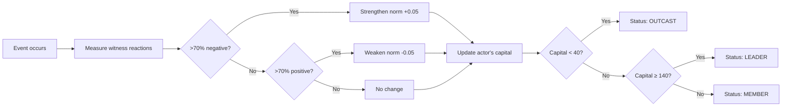

### 4.11 Social Engine (Norms & Hierarchy)

#### Философия Дизайна

Social Engine решает проблему изолированных персонажей: **люди существуют в социальном контексте, где действия имеют репутационные последствия**. Предательство не только ранит жертву, но и меняет восприятие предателя всем обществом. Этот движок моделирует неписаные правила (нормы), социальную иерархию и капитал. Он превращает группу персонажей в живое общество с лидерами, изгоями и ценностями. Он отвечает на вопрос: **как группа судит мои действия и как это влияет на моё место в обществе?**

#### Overview

The Social Engine implements dynamic social dynamics where characters exist in a living social environment with emergent norms and status hierarchies. Characters are no longer isolated individuals - they experience social pressure, gain or lose social capital, and can become opinion leaders or outcasts.

**Key Features:**
- **Dynamic Social Norms**: Unwritten rules emerge from group reactions
- **Social Hierarchy**: Characters gain/lose status based on their actions
- **Social Capital**: Numeric representation of social standing (0-200 scale)
- **Status Effects**: Leaders and outcasts have different influence and credibility

#### State Structure

**L.society Object**:
```javascript
L.society = {
  norms: {
    'betrayal': {
      strength: 0.8,        // How strong this norm is [0-1]
      lastUpdate: 145,      // Turn when last modified
      violations: 3,        // Count of violations
      reinforcements: 7     // Count of reinforcements
    },
    'loyalty': { ... }
  }
};
```

**Character.social Object**:
```javascript
character.social = {
  status: 'member',    // 'leader', 'member', or 'outcast'
  capital: 100,        // Social capital points [0-200]
  conformity: 0.5      // Conformity tendency [0-1]
};
```

#### NormsEngine

**Purpose**: Dynamically tracks and measures strength of unwritten social rules based on how the group reacts to events.

**Main Function**: `LC.NormsEngine.processEvent(eventData)`

**Parameters**:
- `eventData.type` - Type of action (e.g., 'betrayal', 'loyalty', 'violence')
- `eventData.actor` - Character who performed the action
- `eventData.target` - Character affected
- `eventData.witnesses` - Array of witness character names
- `eventData.relationsBefore` - Witness relationships before the event

**Norm Evolution Diagram:**



**Logic**:
```javascript
// If >70% of witnesses reacted negatively
norm.strength = Math.min(1, norm.strength + 0.05);  // Norm strengthens

// If >70% reacted positively
norm.strength = Math.max(0, norm.strength - 0.05);  // Norm weakens

// Violators lose social capital
LC.HierarchyEngine.updateCapital(actor, {
  type: 'NORM_VIOLATION',
  normStrength: norm.strength,
  witnessCount: witnesses.length
});
```

**Helper Function**: `getNormStrength(normType)` - Returns strength [0-1], defaults to 0.5 if not established.

#### HierarchyEngine

**Purpose**: Calculates and maintains social status hierarchy based on characters' social capital.

**Main Functions**:

1. **`updateCapital(characterName, eventData)`** - Modifies social capital based on actions

   Capital Changes:
   - `NORM_VIOLATION`: -10 × normStrength × min(witnessCount/3, 2)
   - `NORM_CONFORMITY`: +5 × normStrength
   - `POSITIVE_ACTION`: +8
   - `NEGATIVE_ACTION`: -5

2. **`recalculateStatus()`** - Periodically recalculates everyone's status

   Status Thresholds:
   - **Leader**: Highest capital character if capital >= 140
   - **Outcast**: Any character with capital < 40
   - **Member**: Everyone else

3. **`getStatus(characterName)`** - Returns character's current status

#### Integration with Other Systems

**UnifiedAnalyzer**:
- Calls `HierarchyEngine.recalculateStatus()` every 20 turns
- Automatic periodic status updates

**LivingWorld**:
- SOCIAL_POSITIVE actions → `updateCapital('POSITIVE_ACTION')`
- SOCIAL_NEGATIVE actions → `updateCapital('NEGATIVE_ACTION')`
- Automatic capital updates during off-screen simulation

**GossipEngine**:
- Rumor spreading considers source's status:
  - **Leaders**: 1.5× credibility (rumors spread 50% more)
  - **Outcasts**: 0.2× credibility (rumors spread 80% less)
- Outcasts add more distortion (50% vs 30% chance)

**Context Overlay**:
- STATUS tags appear for non-member characters:
  ```
  STATUS: Эшли Лидер мнений
  STATUS: Леонид Изгой
  ```
- Weight: 728 (high priority, between TRAITS and MOOD)

#### Typical Workflow

1. **Character performs action** (e.g., betrays another character)
2. **RelationsEngine** detects relationship change
3. **HierarchyEngine** updates capital based on action type
4. **Every 20 turns**: Status recalculated for all characters
5. **Status changes** logged to director-level messages
6. **Context overlay** includes STATUS tags for leaders/outcasts
7. **GossipEngine** uses status for credibility checks

#### Example Usage

**Updating Social Capital**:
```javascript
// Character violates a strong norm
LC.HierarchyEngine.updateCapital('Ashley', {
  type: 'NORM_VIOLATION',
  normStrength: 0.8,
  witnessCount: 5
});
// Result: Ashley loses ~13 capital (10 × 0.8 × 2)

// Character performs helpful action
LC.HierarchyEngine.updateCapital('Ashley', {
  type: 'POSITIVE_ACTION'
});
// Result: Ashley gains 8 capital
```

**Checking Status**:
```javascript
const status = LC.HierarchyEngine.getStatus('Ashley');
// Returns: 'leader', 'member', or 'outcast'
```

**Getting Norm Strength**:
```javascript
const strength = LC.NormsEngine.getNormStrength('betrayal');
// Returns: 0.5 (default) or current strength [0-1]
```

#### Testing

**Test Suite**: `tests/test_social_engine.js`

**Coverage**:
- ✅ Data structure initialization (L.society, character.social)
- ✅ NormsEngine existence and API
- ✅ HierarchyEngine existence and API
- ✅ Social capital updates (positive, negative, norm violations)
- ✅ Status transitions (member → leader, member → outcast)
- ✅ Context overlay STATUS tags
- ✅ Capital capping (0-200 range)
- ✅ GetStatus helper method

**Total**: 27/27 tests passing

**Demo**: `demo_social_engine.js` - Shows complete workflow from equal start to differentiated hierarchy

#### Design Principles

1. **Emergent Norms**: Norms aren't hardcoded - they emerge from group reactions
2. **Capital as Currency**: Status derived from capital, not directly manipulated
3. **Witness-Based**: Social pressure requires witnesses - private actions matter less
4. **Mechanical Effects**: Status has real gameplay consequences (gossip credibility)
5. **Periodic Updates**: Status changes every 20 turns, preventing rapid fluctuations

#### Future Enhancement Opportunities

1. **Full NormsEngine Integration**: Auto-detect witnesses from scene tracking
2. **Decision Weighting**: Factor social pressure into NPC action choices
3. **Outcast Association Penalties**: Lose capital for befriending outcasts
4. **Norm Archetypes**: Pre-defined norm sets for different group types
5. **Reputation Recovery**: Mechanisms for outcasts to regain status

---
