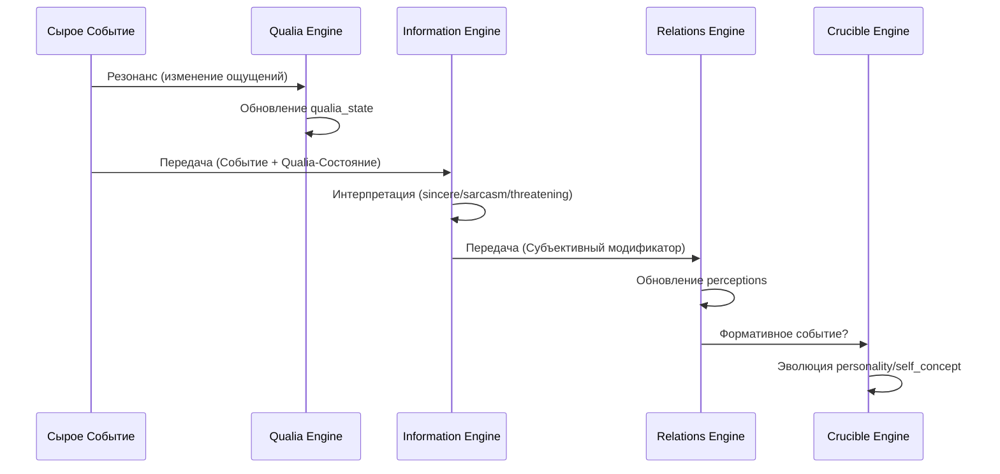

## 6.6 Subjective Reality Engine (The Interpretation Layer)

### Философия Дизайна

Subjective Reality Engine решает ключевую проблему: **два персонажа, переживающие одно и то же событие, могут воспринимать его диаметрально противоположно**. Человек в хорошем настроении воспримет шутку как комплимент; тот же человек в напряжённом состоянии — как сарказм. Этот движок преобразует ощущения в смыслы, создавая асимметричные реальности для каждого персонажа. Он отвечает на вопрос: **что это событие значит для меня, исходя из моего внутреннего состояния?**

### Philosophy: From Sensation to Meaning

The Qualia Engine (6.5) tracks *what a character feels*. The Subjective Reality Engine answers: *how does that feeling color what they believe?*

**Core Insight:** The same event should be interpreted differently by different characters based on their current phenomenal state.

**Example:**
```
Event: "Эшли хвалит Хлою"

Эшли's state: valence = 0.8 (happy)
→ Interpretation: Sincere compliment
→ Эшли.perceptions.Хлоя.affection += 6.5

Хлоя's state: somatic_tension = 0.9 (tense, anxious)
→ Interpretation: Sarcasm/manipulation
→ Хлоя.perceptions.Эшли.trust -= 5
```

**The Result:** Asymmetric reality. Each character sees the other through their own distorted lens.

---

### Architecture

#### Asymmetric Perceptions

**Old System (Symmetric):**
```javascript
L.evergreen.relations['Эшли']['Хлоя'] = 50
L.evergreen.relations['Хлоя']['Эшли'] = 50  // Always equal
```

**New System (Asymmetric):**
```javascript
L.characters['Эшли'].perceptions['Хлоя'] = {
  affection: 70, trust: 60, respect: 50, rivalry: 20
}

L.characters['Хлоя'].perceptions['Эшли'] = {
  affection: 30, trust: 20, respect: 80, rivalry: 50  // Different!
}
```

**Semantic Meaning:**
- **affection:** Emotional warmth, liking, friendship
- **trust:** Reliability, confidence in intentions
- **respect:** Admiration for capabilities/achievements
- **rivalry:** Competitive feelings, desire to outperform

**Asymmetry Enables:**
- Unrequited feelings (one-sided affection)
- Mismatched trust (A trusts B, B doesn't trust A)
- Conflicting perceptions (friends who secretly dislike each other)

#### Information Engine

**Location:** `LC.InformationEngine`

**Core Function:** `interpret(character, event)`

**Process:**
1. **Receive raw event** (compliment, insult, betrayal, etc.)
2. **Check character's qualia_state**
3. **Apply interpretation rules** based on phenomenal state
4. **Return modified event** with subjective modifiers

**Interpretation Matrix:**

| Event Type | Qualia Condition | Interpretation | Effect |
|------------|------------------|----------------|--------|
| Compliment | valence > 0.7 | "sincere" | modifier × 1.3 |
| Compliment | somatic_tension > 0.8 | "sarcasm" | modifier × 0.3, trust -5 |
| Insult | somatic_tension > 0.7 | "threatening" | modifier × 1.5 |
| Insult | valence > 0.7 | "banter" | modifier × 0.4 |
| Betrayal | personality.trust > 0.7 | "devastating" | modifier × 1.3 |
| Betrayal | personality.trust < 0.3 | "expected" | modifier × 0.9 |
| Loyalty | personality.trust < 0.3 | "surprising" | modifier × 1.4 |

**Data Flow Diagram:**



---

### Integration Points

#### 1. Character Initialization

Every character gets a `perceptions` object:

```javascript
// In updateCharacterActivity()
if (!rec.perceptions) {
  rec.perceptions = {};  // Individual, asymmetric perceptions
}
```

#### 2. RelationsEngine

**Modified Functions:**
- `getRelation(char1, char2)` - Prioritizes perceptions, falls back to legacy
- `getVector(char1, char2, vector)` - Returns specific perception dimension
- `updateRelation(char1, char2, change, options)` - Uses InformationEngine if `options.interpretedEvent` provided

**Text Analysis Flow:**
```javascript
// In RelationsEngine.analyze()
const event = {
  type: 'relation_event',
  eventType: 'betrayal',
  rawModifier: -25,
  actor: 'Алекс',
  target: 'Борис'
};

// Each character interprets through their own lens
LC.RelationsEngine.updateRelation('Алекс', 'Борис', -25, { 
  interpretedEvent: event 
});
```

#### 3. LivingWorld Engine

Off-screen character interactions now create asymmetric perceptions:

```javascript
// In LivingWorld.generateFact() - SOCIAL_POSITIVE case
const event = {
  type: 'social',
  action: 'compliment',
  rawModifier: 5,
  actor: characterName,
  target: action.target
};

LC.RelationsEngine.updateRelation(characterName, action.target, 5, { 
  interpretedEvent: event 
});
```

**Result:** 
- Actor interprets their own action (e.g., "I was being nice")
- Target interprets based on their qualia (e.g., "They're mocking me" if tense)

#### 4. Crucible Engine

Receives interpreted events downstream, no changes needed. Crucible processes personality evolution based on *perceived* events, not objective reality.

---

### Backward Compatibility

**Guaranteed:**
1. Legacy `L.evergreen.relations` continues to work
2. Characters without qualia/perceptions use symmetric relations
3. Minimal character objects automatically use legacy mode
4. All existing tests pass unchanged (25/25)

**Detection Logic:**
```javascript
// Use perceptions if character has qualia_state or perceptions
const hasFullChars = char1Obj && char2Obj && 
  (char1Obj.perceptions || char1Obj.qualia_state || 
   char2Obj.perceptions || char2Obj.qualia_state);
   
const usePerceptions = options.usePerceptions !== false && hasFullChars;
```

---

### Usage Examples

#### Example 1: Same Event, Different Interpretations

```javascript
const L = LC.lcInit();

// Create optimist and paranoid
L.characters['Оптимист'].qualia_state.valence = 0.8;        // Happy
L.characters['Параноик'].qualia_state.somatic_tension = 0.9; // Tense

// Same compliment to both
const event = { type: 'social', action: 'compliment', rawModifier: 5 };

const optimistInterp = LC.InformationEngine.interpret(
  L.characters['Оптимист'], event
);
// → interpretation: "sincere", modifier: 6.5

const paranoidInterp = LC.InformationEngine.interpret(
  L.characters['Параноик'], event
);
// → interpretation: "sarcasm", modifier: 1.5, trust: -5
```

#### Example 2: Asymmetric Relationship Evolution

```javascript
// Алекс betrays Борис
LC.RelationsEngine.analyze("Алекс предал Бориса");

// Алекс (cynical, trust=0.2) → "Expected, everyone betrays eventually"
// Борис (trusting, trust=0.8) → "Devastating, I can't believe this"

// Result:
L.characters['Алекс'].perceptions['Борис'].affection -= 20  // Moderate hit
L.characters['Борис'].perceptions['Алекс'].trust -= 32      // Severe trauma
```

#### Example 3: LivingWorld Asymmetric Interactions

```javascript
// During off-screen time jump
LC.LivingWorld.runOffScreenCycle({ type: 'ADVANCE_TO_NEXT_MORNING' });

// Оптимист tries to befriend Параноик (SOCIAL_POSITIVE)
// → Оптимист's perception of Параноик improves significantly
// → Параноик interprets as manipulation, trust decreases

// Later narrative consequences:
// Оптимист: "I thought we were becoming friends!"
// Параноик: "I knew you were up to something..."
```

---

### Performance

- **Memory:** O(N²) for N characters (acceptable for narrative-focused system)
- **CPU:** +0.1ms per event interpretation (negligible)
- **Backward Compatible Mode:** Zero overhead for legacy characters

---

### Future Directions

**Planned Extensions:**
- Memory influence on interpretation (past betrayals → permanent suspicion)
- Social context (public vs private interpretations differ)
- Personality-based interpretation biases (paranoid always suspicious)
- Temporal dynamics (interpretations fade over time)
- Context overlay integration (PERCEPTIONS: CharName tags showing distorted views)

**Potential Integration:**
- Gossip system (rumors filtered through subjective interpretations)
- Secrets system (knowledge acquisition colored by trust levels)
- Memory archiving (store interpreted versions of events, not objective reality)
